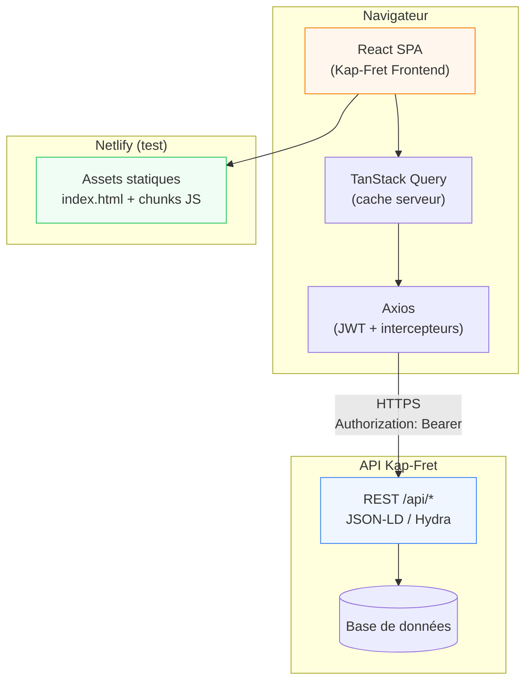

# Kap-Fret Frontend


Interface web de gestion **transport aérien et logistique** pour l'écosystème Kap-Fret.

Ce dépôt correspond à l'**environnement de test** (frontend) consommant l'API REST :

**`https://api.kap-fret.ereborhub.cloud/api`**

> En pratique, la variable `VITE_API_BASE_URL` pointe vers l'hôte **sans** le suffixe `/api` (`https://api.kap-fret.ereborhub.cloud`). Les services appellent déjà les chemins `/api/...`.

**Environnement de test déployé :** [LIEN_NETLIFY](https://[votre-site].netlify.app) <!-- TODO: remplacer par l'URL Netlify réelle -->

---

## Table des matières

- [Description](#description)
- [Prérequis](#prérequis)
- [Compatibilité navigateurs](#compatibilité-navigateurs)
- [Installation](#installation)
- [Configuration](#configuration)
- [Scripts disponibles](#scripts-disponibles)
- [Architecture](#architecture)
- [Déploiement (Netlify)](#déploiement-netlify)
- [Connexion à l'API](#connexion-à-lapi)
- [Bonnes pratiques](#bonnes-pratiques)
- [Tests](#tests)
- [Contribution](#contribution)
- [Troubleshooting](#troubleshooting)
- [Changelog](#changelog)
- [Licence](#licence)
- [Contact](#contact)

---

## Description

Kap-Fret Frontend est une **Single Page Application (SPA)** qui permet aux équipes terrain et back-office de :

- Gérer la **billetterie** (émission, modification, statuts, manifestes passagers)
- Effectuer les **check-ins** passagers et bagages
- Piloter les **expéditions fret** (création, suivi, encaissement)
- Consulter le **tableau de bord** (KPIs, graphiques, activité récente)
- Administrer les référentiels (bureaux, checkpoints, caisses, taux de change, utilisateurs)
- Suivre les **transactions de caisse** et générer des rapports PDF

### Rôle dans l'écosystème

| Composant | Rôle |
|-----------|------|
| **Ce frontend** | Interface utilisateur (React), authentification JWT, formulaires, tableaux de bord |
| **API Kap-Fret** | Logique métier, persistance, sécurité (`https://api.kap-fret.ereborhub.cloud/api`) |
| **Netlify** | Hébergement statique de l'environnement de test (build Vite → `dist/`) |



---

## Prérequis

| Outil | Version minimale | Recommandée | Notes |
|-------|------------------|-------------|-------|
| **Node.js** | 18+ | **22.x** | Aligné sur `netlify.toml` (`NODE_VERSION = "22"`) |
| **npm** | 9+ | 10+ | Fourni avec Node |
| **Git** | 2.x | — | Clone et contributions |
| **Navigateur moderne** | Voir ci-dessous | Dernière stable | Chrome, Firefox, Edge, Safari |

Optionnel :

- [Netlify CLI](https://docs.netlify.com/cli/get-started/) — déploiement et preview depuis le terminal
- Accès réseau à l'API de test : `https://api.kap-fret.ereborhub.cloud`

---

## Compatibilité navigateurs

| Navigateur | Support |
|------------|---------|
| Google Chrome | Dernière version stable |
| Mozilla Firefox | Dernière version stable |
| Microsoft Edge | Dernière version stable |
| Safari (macOS / iOS) | 2 dernières versions majeures |

L'application cible les **navigateurs modernes** (ESM, `fetch`, CSS Grid/Flexbox). Internet Explorer n'est pas supporté.

---

## Installation

```bash
# 1. Cloner le dépôt
git clone [URL_DU_REPO] kap-fret-app
cd kap-fret-app

# 2. Installer les dépendances
npm install

# 3. Configurer l'environnement
cp .env.example .env

# 4. Lancer le serveur de développement
npm run dev
```

L'application est accessible sur **http://localhost:5173**.

Pour tester contre l'API distante en local :

```bash
# Option A — proxy Vite (recommandé en dev, pas de CORS)
# Laisser VITE_API_BASE_URL vide dans .env
npm run dev

# Option B — build + preview comme en production
VITE_API_BASE_URL=https://api.kap-fret.ereborhub.cloud npm run build
npm run preview
```

---

## Configuration

### Fichier `.env`

Copier `.env.example` vers `.env` et adapter :

```env
# ─── Développement local ───────────────────────────────────────────────
# Laisser vide : les requêtes passent par le proxy Vite (/api → backend).
# Évite les problèmes CORS en dev.
VITE_API_BASE_URL=

# Cible du proxy Vite (dev uniquement)
VITE_PROXY_TARGET=https://localhost:8000

# ─── Production / Preview / Netlify ────────────────────────────────────
# Hôte de l'API SANS le suffixe /api
# VITE_API_BASE_URL=https://api.kap-fret.ereborhub.cloud
```

> **Note :** certaines documentations mentionnent `VITE_API_URL`. Ce projet utilise **`VITE_API_BASE_URL`** — c'est la variable lue par `src/lib/api-config.ts`. La valeur cible en production reste `https://api.kap-fret.ereborhub.cloud` ; les routes applicatives sont préfixées `/api` dans le code.

### Variables critiques

| Variable | Obligatoire en prod | Description |
|----------|---------------------|-------------|
| `VITE_API_BASE_URL` | **Oui** | Racine HTTP de l'API (ex. `https://api.kap-fret.ereborhub.cloud`). **Ne pas** terminer par `/api`. |
| `VITE_PROXY_TARGET` | Non (dev only) | Backend cible du proxy Vite (`/api` → cette URL). Ignoré en production. |

### Résolution des URLs

| Contexte | `VITE_API_BASE_URL` | `GET /api/tickets` → URL finale |
|----------|---------------------|----------------------------------|
| `npm run dev` | *(vide)* | `http://localhost:5173/api/tickets` → proxy → backend |
| `npm run preview` / Netlify | `https://api.kap-fret.ereborhub.cloud` | `https://api.kap-fret.ereborhub.cloud/api/tickets` |

### Sécurité

- Le fichier `.env` est **ignoré par Git** (ne jamais committer de secrets).
- Les variables `VITE_*` sont **injectées dans le bundle client** — n'y mettre que des URLs publiques, jamais de clés secrètes.

---

## Scripts disponibles

| Commande | Description |
|----------|-------------|
| `npm run dev` | Serveur de développement Vite (HMR) — port **5173** |
| `npm run build` | Compilation TypeScript (`tsc -b`) + build production dans `dist/` |
| `npm run preview` | Sert le build localement — port **4173** (simule la prod) |
| `npm run lint` | Analyse statique ESLint sur tout le projet |

```bash
# Build de production
npm run build

# Vérifier le build avec l'API distante
VITE_API_BASE_URL=https://api.kap-fret.ereborhub.cloud npm run build
npm run preview
```

> **Note :** aucun script `npm run test` n'est configuré pour l'instant. Voir la section [Tests](#tests).

---

## Architecture

### Structure des dossiers

```
kap-fret-app/
├── public/                     # Assets statiques (favicon.svg, etc.)
├── src/
│   ├── app/                    # Point d'entrée React (App.tsx)
│   ├── main.tsx                # Bootstrap DOM
│   ├── routes/
│   │   ├── index.tsx           # Définition du router (createBrowserRouter)
│   │   ├── lazy-page.tsx       # Helper React.lazy + Suspense
│   │   ├── lazy-pages.ts       # Toutes les pages en chargement différé
│   │   └── ProtectedRoute.tsx  # Garde d'authentification et rôles
│   ├── layouts/                # AppLayout, AuthLayout
│   ├── pages/                  # Écrans métier (tickets, fret, admin…)
│   ├── components/             # UI, formulaires, dashboard, modales
│   ├── hooks/                  # Hooks React Query par domaine
│   ├── services/               # Client Axios + services API
│   ├── lib/                    # Hydra, stats, PDF, filtres, api-config
│   ├── providers/              # AuthProvider, QueryProvider, SidebarProvider
│   ├── schemas/                # Schémas Zod (validation formulaires)
│   ├── constants/              # Rôles, endpoints, clés localStorage
│   └── types/                  # Types TypeScript (Hydra, entités métier)
├── netlify.toml                # Build + redirect SPA Netlify
├── vite.config.ts              # Vite, proxy dev, alias @/, code splitting
├── .env.example                # Modèle de variables d'environnement
├── eslint.config.js            # Configuration ESLint
└── dist/                       # Sortie du build (généré, non versionné)
```

### Stack technique

| Couche | Technologie | Rôle |
|--------|-------------|------|
| UI | React 19 | Composants, hooks |
| Build | Vite 8 | Bundler, HMR, ESM natif |
| Langage | TypeScript 6 (strict) | Typage fort |
| Styles | Tailwind CSS 4 | Utility-first, responsive |
| UI Kit | Radix UI + composants maison | Accessibilité, dialogs, selects |
| Routing | React Router 7 | SPA, routes protégées par rôle |
| Data fetching | TanStack Query 5 | Cache, invalidation, états async |
| HTTP | Axios | JWT, refresh token, intercepteurs |
| Formulaires | React Hook Form + Zod 4 | Validation déclarative |
| Graphiques | Recharts 3 | Dashboard statistiques |
| PDF | jsPDF + jspdf-autotable | Manifestes, rapports de caisse |
| Notifications | Sonner | Toasts utilisateur |
| Icônes | Lucide React | Iconographie cohérente |

### Pourquoi Vite plutôt que Webpack ?

- **Démarrage rapide** en dev grâce aux modules ESM natifs (pas de bundle complet au cold start)
- **Configuration minimale** pour React + TypeScript + Tailwind
- **Build Rollup/Rolldown** optimisé avec code splitting automatique
- **Écosystème aligné** avec React 19 et les versions récentes de TypeScript

### Gestion d'état

| Type d'état | Solution |
|-------------|----------|
| Données serveur | **TanStack Query** — cache, refetch, clés par filtres |
| Authentification | **React Context** (`AuthProvider`) + `localStorage` (JWT, refresh, profil) |
| UI locale | `useState` / formulaires contrôlés (React Hook Form) |
| Navigation | React Router 7 |

Pas de Redux : la complexité métier est portée par React Query et les services API.

### Code splitting et performances

Les pages sont chargées **à la demande** via `lazy-pages.ts` et le helper `lazyPage()` :

```typescript
// src/routes/lazy-pages.ts
export const DashboardPage = lazyPage(
  () => import('@/pages/dashboard/DashboardPage'),
  'DashboardPage',
)
```

Tailles indicatives après `npm run build` :

| Chunk | Taille (gzip) | Chargé quand |
|-------|---------------|--------------|
| Bundle initial (`index` + vendors) | ~170 Ko | Première visite / login |
| `DashboardPage` (Recharts) | ~129 Ko | Navigation vers `/dashboard` |
| `passenger-manifest-pdf` (jsPDF) | ~141 Ko | Export PDF manifeste |

Le bundle initial est d'environ **~556 Ko** (non compressé) au lieu d'un monolithe ~2 Mo.

---

## Déploiement (Netlify)

### Configuration (`netlify.toml`)

```toml
[build]
  command = "npm run build"
  publish = "dist"

# SPA React Router — évite les 404 au refresh direct
[[redirects]]
  from = "/*"
  to = "/index.html"
  status = 200

[build.environment]
  NODE_VERSION = "22"
```

### Variables d'environnement Netlify

Dans **Site settings → Environment variables** :

| Clé | Valeur (Production / Preview) |
|-----|-------------------------------|
| `VITE_API_BASE_URL` | `https://api.kap-fret.ereborhub.cloud` |

> Sans cette variable, le build réussit mais l'application ne peut pas joindre l'API en production.

### Déploiement via CLI

```bash
npm install -g netlify-cli
netlify login
netlify init

netlify env:set VITE_API_BASE_URL "https://api.kap-fret.ereborhub.cloud"

# Preview
netlify deploy --build

# Production
netlify deploy --prod --build
```

### Déploiement via Git (recommandé)

1. Connecter le dépôt GitHub/GitLab à Netlify
2. Build command : `npm run build`
3. Publish directory : `dist`
4. Ajouter `VITE_API_BASE_URL` dans l'UI Netlify
5. Chaque push sur la branche de production déclenche un déploiement

### Checklist post-déploiement

- [ ] Page de login accessible
- [ ] Authentification JWT fonctionnelle (`POST /api/authentication_token`)
- [ ] `GET /api/users/about` sans erreur CORS
- [ ] Navigation directe vers `/tickets`, `/freight` (pas de 404 — redirect SPA)
- [ ] Dashboard et listes chargent les données API
- [ ] Origine Netlify whitelistée côté backend CORS

**URL de test :** [LIEN_NETLIFY](https://[votre-site].netlify.app) <!-- TODO -->

---

## Connexion à l'API

### URL de base

| Élément | Valeur |
|---------|--------|
| Hôte API | `https://api.kap-fret.ereborhub.cloud` |
| Préfixe routes | `/api` |
| URL complète exemple | `https://api.kap-fret.ereborhub.cloud/api/tickets` |
| Format réponses listes | JSON-LD / Hydra (`hydra:member`, `hydra:totalItems`) |
| Authentification | JWT Bearer (`Authorization: Bearer <token>`) |

### Configuration Axios

Client centralisé dans `src/services/api.ts` :

```typescript
import axios from 'axios'
import { getApiBaseUrl } from '@/lib/api-config'
import { STORAGE_KEYS } from '@/constants/storage'

export const api = axios.create({
  headers: {
    Accept: 'application/ld+json',
    'Content-Type': 'application/ld+json',
  },
})

api.interceptors.request.use((config) => {
  config.baseURL = getApiBaseUrl()

  const token = localStorage.getItem(STORAGE_KEYS.TOKEN)
  if (token) {
    config.headers.set('Authorization', `Bearer ${token}`)
  }

  if (config.method?.toLowerCase() === 'get') {
    config.headers.delete('Content-Type')
  }

  return config
})
```

Résolution de l'URL (`src/lib/api-config.ts`) :

```typescript
export function getApiBaseUrl(): string {
  if (import.meta.env.DEV) return ''
  const envUrl = import.meta.env.VITE_API_BASE_URL
  if (envUrl?.trim()) return envUrl.replace(/\/$/, '')
  // En prod sans variable : log d'erreur + fallback dev
  return 'http://localhost:8000'
}
```

### Exemple : login + profil utilisateur

```typescript
// POST /api/authentication_token
const { data: auth } = await api.post(
  '/api/authentication_token',
  { username: 'agent@exemple.com', password: '********' },
  { headers: { Accept: 'application/json', 'Content-Type': 'application/json' } },
)
// auth.token, auth.refresh_token

// GET /api/users/about
const { data: user } = await api.get('/api/users/about')
```

### Exemple : liste Hydra

```typescript
import { api } from '@/services/api'
import { extractHydraMember } from '@/lib/hydra'

const { data } = await api.get('/api/tickets', {
  params: { page: 1, itemsPerPage: 15, 'order[createdAt]': 'desc' },
})

const tickets = extractHydraMember(data)
const total = data['hydra:totalItems']
```

### Gestion des erreurs (intercepteur)

```typescript
api.interceptors.response.use(
  (response) => response,
  async (error) => {
    const originalRequest = error.config

    // Pas de redirection auto sur login ou requêtes marquées skipAuthRedirect
    if (originalRequest?.skipAuthRedirect) {
      return Promise.reject(error)
    }

    // 401 → tentative refresh token, sinon redirection /login
    if (error.response?.status === 401 && !originalRequest?._retry) {
      // ... logique refresh JWT ...
    }

    // Toast utilisateur (Hydra, RFC 7807, erreurs réseau)
    handleApiError(error)
    return Promise.reject(error)
  },
)
```

Les flags internes (`skipAuthRedirect`, `_retry`) sont des propriétés **Axios** — ils ne doivent **pas** être envoyés comme en-têtes HTTP (sinon échec du preflight CORS).

Messages d'erreur extraits via `extractApiErrorMessage()` : `hydra:description`, `detail`, `violations` (422).

### CORS

En production, le frontend (Netlify) et l'API (sous-domaine distinct) communiquent en **cross-origin**.

| Côté frontend | Côté backend (à configurer) |
|---------------|----------------------------|
| `VITE_API_BASE_URL` correctement défini | `Access-Control-Allow-Origin` incluant l'URL Netlify |
| Pas d'en-têtes HTTP custom non standards | Autoriser `Authorization`, `Content-Type`, `Accept` |
| En dev : proxy Vite (`VITE_API_BASE_URL` vide) | Whitelister `http://localhost:5173` si appel direct |

---

## Bonnes pratiques

### Conventions de code

- **TypeScript strict** — `tsconfig.app.json`
- **ESLint** — exécuter `npm run lint` avant toute PR
- **Alias** `@/` → `src/`
- **Nommage** :
  - Composants : `PascalCase` (`TicketForm.tsx`)
  - Hooks : `use` + `camelCase` (`useTickets.ts`)
  - Services : `*.service.ts`
  - Schémas Zod : `src/schemas/`
  - Types : `src/types/`
- **Formulaires** : schéma Zod + `zodResolver` (React Hook Form)

### Gestion des états

1. **Données API** → hooks React Query (`useTickets`, `useStats`, etc.)
2. **Auth globale** → `AuthProvider` + `useAuth()`
3. **Formulaires** → état local React Hook Form
4. **Filtres de page** → `useState` / URL search params selon le cas

### Optimisations

| Technique | Statut | Détail |
|-----------|--------|--------|
| Lazy loading par route | Actif | `lazy-pages.ts` + `Suspense` |
| Vendor chunks | Actif | `react-vendor`, `data-vendor` dans `vite.config.ts` |
| React Query cache | Actif | `staleTime`, clés par filtres et pagination |
| Proxy dev anti-CORS | Actif | `vite.config.ts` → `/api` |
| PDF / Recharts | À la demande | Chunks séparés, chargés à l'usage |

Piste d'amélioration : `import()` dynamique de jsPDF **au clic** sur « Exporter PDF » pour retarder encore le chunk PDF.

---

## Tests

> **État actuel :** aucune suite de tests automatisés n'est configurée dans ce dépôt.

| Outil suggéré | Usage |
|---------------|-------|
| **Vitest** | Tests unitaires (`lib/`, parsers Hydra, stats) |
| **Testing Library** | Tests de composants React |
| **Playwright** ou **Cypress** | Tests E2E (login, création billet, check-in) |

```bash
# À configurer — placeholders
# npm run test
# npm run test:coverage
# npm run test:e2e
```

**Couverture cible suggérée :** `src/lib/`, `src/services/`, parsers Hydra, hooks critiques (`useAuth`, `useStats`).

---

## Contribution

### Workflow

1. Fork ou branche feature depuis `main`
2. `git checkout -b feat/ma-fonctionnalite`
3. Développer
4. `npm run lint` et `npm run build`
5. Ouvrir une Pull Request

### Conventions de commit (Conventional Commits)

```
feat(tickets): ajouter filtre par bureau émetteur
fix(auth): corriger preflight CORS sur /users/about
docs(readme): mettre à jour section Netlify
perf(bundle): lazy load des pages métier
chore(deps): bump vite to 8.x
```

### Template de Pull Request

```markdown
## Résumé
<!-- Quoi et pourquoi en 2-3 phrases -->

## Type de changement
- [ ] Bug fix
- [ ] Nouvelle fonctionnalité
- [ ] Refactoring
- [ ] Documentation
- [ ] Performance

## Checklist
- [ ] `npm run lint` OK
- [ ] `npm run build` OK
- [ ] Testé en local (`npm run dev` ou `npm run preview`)
- [ ] Pas de secret committé (`.env`)
- [ ] Variable `VITE_API_BASE_URL` documentée si modifiée
- [ ] Screenshots si changement UI

## Issues liées
Closes #<!-- numéro -->
```

### Règles de review

- PR **petite et focalisée** (< 400 lignes si possible)
- Pas de refactor hors scope
- Respect des patterns existants (services → hooks → pages)
- Vérifier l'impact CORS / auth pour tout changement Axios
- Pas de régression sur le code splitting (éviter les imports statiques de libs lourdes dans `App.tsx` ou les layouts)

---

## Troubleshooting

### Erreur CORS / « Preflight response is not successful »

**Symptôme :** requête bloquée après login, `OPTIONS` en 400 dans l'onglet Network.

**Causes fréquentes :**
- Origine Netlify ou `localhost:4173` non whitelistée côté API
- En-têtes HTTP personnalisés envoyés au serveur (ex. anciens `X-Skip-Auth-Redirect`)

**Solutions :**
- En dev : laisser `VITE_API_BASE_URL` vide et utiliser `npm run dev` (proxy Vite)
- Demander l'ajout de l'origine exacte dans la config CORS backend
- Vérifier que les flags Axios (`skipAuthRedirect`) restent dans `config`, pas dans `headers`

### Build échoue (`tsc` ou Vite)

```bash
npm run build
```

- Erreurs TypeScript → corriger les types avant le merge
- Vérifier Node 22 (`netlify.toml` ou `nvm use 22`)
- Supprimer `node_modules` et réinstaller : `rm -rf node_modules && npm install`

### 404 sur refresh (`/tickets/123`)

Vérifier la redirection SPA dans `netlify.toml` :

```toml
[[redirects]]
  from = "/*"
  to = "/index.html"
  status = 200
```

### API injoignable en preview local

```bash
VITE_API_BASE_URL=https://api.kap-fret.ereborhub.cloud npm run build
npm run preview
```

### `VITE_API_BASE_URL` manquant en production

**Symptôme :** console `[KAP FRET] VITE_API_BASE_URL est manquant en production...`

**Solution :** configurer la variable dans Netlify → **Site settings → Environment variables** → redéployer.

### Dashboard à 0 / stats incorrectes

- Vérifier que `GET /api/stats` répond (erreur 500 = problème backend)
- Vérifier les filtres de période et de devise sur le dashboard
- Consulter l'onglet Network pour les erreurs API

### Bundle JS volumineux (avertissement Netlify)

Le code splitting est en place. Un avertissement peut subsister sur la **taille totale** des assets, mais le **chargement initial** est réduit (~556 Ko). Les chunks Recharts et PDF ne se chargent qu'à l'usage.

---

## Changelog

### [0.0.0] — Environnement de test

#### Ajouté
- Application React complète (billetterie, check-in, fret, caisses, admin)
- Tableau de bord avec KPIs, graphiques Recharts, activité récente
- Authentification JWT + refresh token
- Export PDF (manifestes passagers, fret, rapports caisse)
- Configuration Netlify (`netlify.toml`)
- Lazy loading des pages (`lazy-pages.ts`)
- Code splitting vendors (`react-vendor`, `data-vendor`)

#### Corrigé
- Preflight CORS : flags Axios internes hors en-têtes HTTP
- Filtres dashboard (devise, période, revenus multi-devises)
- Favicon et variables d'environnement documentées

#### À venir
- Suite de tests (Vitest + Playwright)
- URL Netlify de test définitive
- Changelog détaillé dans `CHANGELOG.md` <!-- TODO: créer le fichier si besoin -->

---

## Licence

**Proprietary — Tous droits réservés.**

Ce code est la propriété de **[NOM_ORGANISATION]** <!-- TODO: nom légal de l'organisation -->.  
Toute reproduction ou distribution sans autorisation écrite est interdite.

<!-- Alternative open source à confirmer : MIT, Apache 2.0 -->

---

## Contact

**Benjamin KALOMBO**  
Développeur Frontend — Kap-Fret

| Canal | Lien |
|-------|------|
| Email | [benjamin.kalombo@exemple.com](mailto:benjamin.kalombo@exemple.com) <!-- TODO --> |
| GitHub | [@votre-github](https://github.com/votre-github) <!-- TODO --> |
| LinkedIn | [Profil LinkedIn](https://linkedin.com/in/votre-profil) <!-- TODO --> |

---

<p align="center">
  <sub>Kap-Fret · Environnement de test frontend</sub>
</p>
