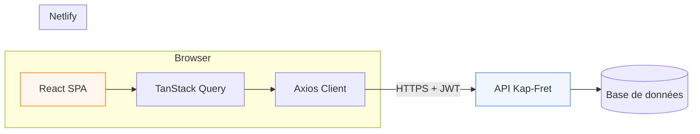

# Kap-Fret Frontend


Interface web de gestion **transport aérien et logistique** pour l'écosystème Kap-Fret.  
Ce dépôt correspond à l'**environnement de test** (frontend) consommant l'API REST hébergée sur :

**`https://api.kap-fret.ereborhub.cloud`**

> Les routes applicatives sont préfixées par `/api` (ex. `/api/tickets`, `/api/users/about`).

**Environnement de test déployé :** [LIEN_NETLIFY](https://[votre-site].netlify.app) <!-- TODO: remplacer par l'URL Netlify réelle -->

---

## Table des matières

- [Description](#description)
- [Prérequis](#prérequis)
- [Installation](#installation)
- [Configuration](#configuration)
- [Scripts disponibles](#scripts-disponibles)
- [Architecture](#architecture)
- [Déploiement (Netlify)](#déploiement-netlify)
- [Connexion à l'API](#connexion-à-lapi)
- [Bonnes pratiques](#bonnes-pratiques)
- [Tests](#tests)
- [Contribution](#contribution)
- [Troubleshooting](#troubleshooting)
- [Changelog](#changelog)
- [Licence](#licence)
- [Contact](#contact)

---

## Description

Kap-Fret Frontend est une **Single Page Application (SPA)** qui permet aux équipes terrain et back-office de :

- Gérer la **billetterie** (émission, modification, statuts)
- Effectuer les **check-ins** passagers et bagages
- Piloter les **expéditions fret** (création, suivi, encaissement)
- Consulter le **tableau de bord** (KPIs, graphiques, statistiques)
- Administrer les référentiels (bureaux, checkpoints, caisses, taux de change, utilisateurs)
- Suivre les **transactions de caisse** et générer des rapports PDF

L'application s'appuie sur une API **Symfony / API Platform** exposant des collections **JSON-LD / Hydra**.



---

## Prérequis

| Outil | Version minimale | Notes |
|-------|------------------|-------|
| **Node.js** | 22.x (recommandé) | Aligné sur `netlify.toml` |
| **npm** | 10+ | Fourni avec Node 22 |
| **Git** | 2.x | Clone du dépôt |
| Navigateur moderne | Dernière version stable | Chrome, Firefox, Safari, Edge |

Optionnel :

- [Netlify CLI](https://docs.netlify.com/cli/get-started/) pour simuler le déploiement en local
- Accès à l'API de test (`https://api.kap-fret.ereborhub.cloud`)

---

## Installation

```bash
# 1. Cloner le dépôt
git clone [URL_DU_REPO] kap-fret-app
cd kap-fret-app

# 2. Installer les dépendances
npm install

# 3. Configurer l'environnement
cp .env.example .env

# 4. Lancer le serveur de développement
npm run dev
```

L'application est accessible sur **http://localhost:5173**.

---

## Configuration

### Fichier `.env`

```env
# ─── Développement local ───────────────────────────────────────────────
# Laisser vide : les requêtes passent par le proxy Vite (/api → backend).
# Évite les problèmes CORS en dev.
VITE_API_BASE_URL=

# Cible du proxy Vite (dev uniquement)
VITE_PROXY_TARGET=https://localhost:8000

# ─── Production / Preview (npm run preview) / Netlify ────────────────
# URL de BASE du backend, SANS le suffixe /api
# VITE_API_BASE_URL=https://api.kap-fret.ereborhub.cloud
```

### Variables critiques

| Variable | Obligatoire en prod | Description |
|----------|---------------------|-------------|
| `VITE_API_BASE_URL` | **Oui** | Hôte de l'API (ex. `https://api.kap-fret.ereborhub.cloud`). Les services appellent déjà `/api/...`. **Ne pas** ajouter `/api` à la fin. |
| `VITE_PROXY_TARGET` | Non (dev only) | URL du backend local pour le proxy Vite. Ignorée en production. |

> **Pourquoi `VITE_API_BASE_URL` et pas `VITE_API_URL` ?**  
> Vite n'expose que les variables préfixées par `VITE_`. Le projet utilise `VITE_API_BASE_URL` comme racine HTTP ; les chemins `/api/*` sont définis dans les services.

### Exemple de résolution d'URL

| Contexte | `VITE_API_BASE_URL` | Requête `GET /api/tickets` → URL finale |
|----------|---------------------|----------------------------------------|
| `npm run dev` | *(vide)* | `http://localhost:5173/api/tickets` → proxy → backend |
| `npm run preview` / Netlify | `https://api.kap-fret.ereborhub.cloud` | `https://api.kap-fret.ereborhub.cloud/api/tickets` |

---

## Scripts disponibles

| Commande | Description |
|----------|-------------|
| `npm run dev` | Serveur de développement Vite (HMR) sur le port 5173 |
| `npm run build` | Compilation TypeScript + build de production dans `dist/` |
| `npm run preview` | Sert le build localement (port 4173) — simule la prod |
| `npm run lint` | Analyse statique ESLint sur le projet |

```bash
# Build de production
npm run build

# Tester le build en local (avec l'API distante)
VITE_API_BASE_URL=https://api.kap-fret.ereborhub.cloud npm run build
npm run preview
```

> **Note :** aucun script `test` n'est configuré pour l'instant. Voir la section [Tests](#tests).

---

## Architecture

### Structure des dossiers

```
kap-fret-app/
├── public/                 # Assets statiques (favicon, icônes)
├── src/
│   ├── app/                # Bootstrap React (App, main)
│   ├── routes/             # Router, routes protégées par rôle
│   ├── layouts/            # AppLayout, AuthLayout
│   ├── pages/              # Pages métier (tickets, fret, admin…)
│   ├── components/         # UI réutilisable, formulaires, dashboard
│   ├── hooks/              # Hooks React Query par domaine
│   ├── services/           # Client Axios + services API
│   ├── lib/                # Utilitaires (Hydra, stats, PDF, filtres)
│   ├── providers/          # AuthProvider, QueryClientProvider
│   ├── schemas/            # Schémas Zod (validation formulaires)
│   ├── constants/          # Rôles, statuts, libellés
│   └── types/              # Types TypeScript (Hydra, entités)
├── netlify.toml            # Configuration déploiement Netlify
├── vite.config.ts          # Vite + proxy dev + alias @/
├── .env.example            # Modèle de variables d'environnement
└── dist/                   # Sortie du build (généré)
```

### Stack technique

| Couche | Technologie | Rôle |
|--------|-------------|------|
| UI | React 19 | Composants, hooks |
| Build | Vite 8 | Bundler rapide, HMR, ESM natif |
| Langage | TypeScript 6 (strict) | Typage fort, maintenabilité |
| Styles | Tailwind CSS 4 | Utility-first, mobile first |
| UI Kit | Radix UI + composants maison | Accessibilité, dialogs, selects |
| Routing | React Router 7 | SPA, routes protégées |
| Data fetching | TanStack Query 5 | Cache, invalidation, états async |
| HTTP | Axios | Intercepteurs JWT, refresh token |
| Formulaires | React Hook Form + Zod | Validation déclarative |
| Graphiques | Recharts | Dashboard statistiques |
| PDF | jsPDF + autotable | Manifestes, rapports de caisse |
| Notifications | Sonner | Toasts utilisateur |

### Pourquoi Vite plutôt que Webpack ?

- **Démarrage instantané** en dev (ESM natif, pas de bundle complet au cold start)
- **Configuration minimale** pour React + TypeScript
- **Build Rollup** optimisé pour la production
- **Écosystème moderne** aligné avec React 19 et les dernières versions de TypeScript

### Gestion d'état

- **Serveur** : TanStack Query (cache des listes, détails, stats)
- **Auth** : React Context (`AuthProvider`) + `localStorage` (JWT, refresh token, profil)
- **UI locale** : `useState` / `useReducer` dans les composants et formulaires

Pas de Redux : la complexité métier est portée par React Query et les services API.

---

## Déploiement (Netlify)

### Configuration (`netlify.toml`)

```toml
[build]
  command = "npm run build"
  publish = "dist"

[[redirects]]
  from = "/*"
  to = "/index.html"
  status = 200

[build.environment]
  NODE_VERSION = "22"
```

La redirection `/* → /index.html` est **obligatoire** pour React Router (évite les 404 sur refresh direct).

### Variables Netlify

Dans **Site settings → Environment variables** :

| Clé | Valeur (Production) |
|-----|---------------------|
| `VITE_API_BASE_URL` | `https://api.kap-fret.ereborhub.cloud` |

### Déploiement via CLI

```bash
npm install -g netlify-cli
netlify login
netlify init

netlify env:set VITE_API_BASE_URL "https://api.kap-fret.ereborhub.cloud"

# Preview
netlify deploy --build

# Production
netlify deploy --prod --build
```

### Checklist post-déploiement

- [ ] Page de login accessible
- [ ] Authentification JWT fonctionnelle
- [ ] Navigation directe vers `/tickets`, `/freight` (pas de 404)
- [ ] Pas d'erreur CORS dans la console navigateur
- [ ] Dashboard et listes chargent les données API

---

## Connexion à l'API

### URL de base

| Environnement | Base URL |
|---------------|----------|
| Production / Test | `https://api.kap-fret.ereborhub.cloud` |
| Préfixe routes | `/api` |

### Configuration Axios

Le client HTTP est centralisé dans `src/services/api.ts` :

```typescript
import axios from 'axios'
import { getApiBaseUrl } from '@/lib/api-config'
import { STORAGE_KEYS } from '@/constants/storage'

export const api = axios.create({
  headers: {
    Accept: 'application/ld+json',
    'Content-Type': 'application/ld+json',
  },
})

api.interceptors.request.use((config) => {
  config.baseURL = getApiBaseUrl()

  const token = localStorage.getItem(STORAGE_KEYS.TOKEN)
  if (token) {
    config.headers.set('Authorization', `Bearer ${token}`)
  }

  if (config.method?.toLowerCase() === 'get') {
    config.headers.delete('Content-Type')
  }

  return config
})
```

`getApiBaseUrl()` (`src/lib/api-config.ts`) :

- **Dev** → `''` (requêtes relatives, proxy Vite)
- **Prod** → `import.meta.env.VITE_API_BASE_URL`

### Exemple : authentification + profil utilisateur

```typescript
// POST /api/authentication_token
const { data } = await api.post('/api/authentication_token', {
  username: 'agent@exemple.com',
  password: '********',
}, {
  headers: { Accept: 'application/json', 'Content-Type': 'application/json' },
})

// GET /api/users/about (profil connecté)
const { data: user } = await api.get('/api/users/about', {
  headers: { Accept: 'application/ld+json' },
})
```

### Collections Hydra

Les listes API Platform sont lues via `hydra:member` :

```typescript
import { extractHydraMember } from '@/lib/hydra'

const { data } = await api.get('/api/tickets', {
  params: { page: 1, itemsPerPage: 15, 'order[createdAt]': 'desc' },
})

const tickets = extractHydraMember(data)
```

### CORS

En production, le frontend (Netlify) et l'API (sous-domaine distinct) communiquent en **cross-origin**.

- Le backend doit autoriser l'origine Netlify dans `Access-Control-Allow-Origin`
- Les en-têtes autorisés côté API : `content-type`, `authorization`
- **Ne pas** envoyer d'en-têtes HTTP personnalisés depuis le frontend (les flags internes Axios comme `skipAuthRedirect` restent dans la config Axios, pas dans les headers)

---

## Bonnes pratiques

### Conventions de code

- **TypeScript strict** activé (`tsconfig.app.json`)
- **ESLint** : `npm run lint` avant toute PR
- **Alias** `@/` → `src/`
- **Nommage** :
  - Composants : `PascalCase` (`TicketForm.tsx`)
  - Hooks : `use` + `camelCase` (`useTickets.ts`)
  - Services : `camelCase` + suffixe `.service.ts`
  - Types : `PascalCase` dans `src/types/`
- **Formulaires** : schéma Zod dans `src/schemas/`, resolver Hook Form

### Optimisations

| Technique | Statut | Détail |
|-----------|--------|--------|
| Code splitting par route | À améliorer | Bundle principal ~2 Mo (Recharts, jsPDF) |
| React Query cache | Actif | `staleTime`, clés par filtres |
| Lazy loading images | Partiel | Assets dans `public/` |
| Proxy dev anti-CORS | Actif | `vite.config.ts` |

Piste d'amélioration : `React.lazy()` sur les pages admin et modules PDF.

---

## Tests

> **État actuel :** aucune suite de tests automatisés n'est configurée dans ce dépôt.

| Outil suggéré | Usage |
|---------------|-------|
| **Vitest** | Tests unitaires (utils, parsers Hydra, stats) |
| **Testing Library** | Tests composants React |
| **Playwright / Cypress** | Tests E2E (login, création billet) |

```bash
# À venir — placeholder
# npm run test
# npm run test:coverage
```

**Couverture cible suggérée :** `lib/`, `services/`, parsers Hydra, hooks critiques.

---

## Contribution

### Workflow

1. Fork / branche feature depuis `main`
2. `git checkout -b feat/ma-fonctionnalite`
3. Développer + `npm run lint` + `npm run build`
4. Ouvrir une Pull Request

### Conventions de commit (Conventional Commits)

```
feat(tickets): ajouter filtre par bureau émetteur
fix(auth): corriger preflight CORS sur /users/about
docs(readme): mettre à jour section Netlify
chore(deps): bump vite to 8.x
```

### Template de Pull Request

```markdown
## Résumé
<!-- Quoi et pourquoi en 2-3 phrases -->

## Type de changement
- [ ] Bug fix
- [ ] Nouvelle fonctionnalité
- [ ] Refactoring
- [ ] Documentation

## Checklist
- [ ] `npm run lint` OK
- [ ] `npm run build` OK
- [ ] Testé en local (`npm run dev` ou `preview`)
- [ ] Pas de secret committé (.env)
- [ ] Screenshots si changement UI

## Issues liées
Closes #<!-- numéro -->
```

### Review

- PR petite et focalisée (< 400 lignes si possible)
- Pas de refactor hors scope
- Respect des patterns existants (services, hooks, Hydra)

---

## Troubleshooting

### Erreur CORS / « Preflight response is not successful »

**Symptôme :** requête bloquée après login, `OPTIONS` en 400.

**Causes fréquentes :**
- En-têtes HTTP custom non autorisés par l'API
- Origine non whitelistée (ex. `http://localhost:4173`)

**Solutions :**
- Vérifier que `VITE_API_BASE_URL` est correct
- Demander l'ajout de l'origine Netlify / localhost côté backend CORS
- En dev : laisser `VITE_API_BASE_URL` vide et utiliser `npm run dev` (proxy)

### Build échoue sur Netlify

- Vérifier `NODE_VERSION = 22` dans `netlify.toml`
- Vérifier les logs : erreurs TypeScript (`tsc -b`)
- Confirmer `VITE_API_BASE_URL` dans les variables Netlify

### 404 sur refresh (`/tickets/123`)

- Vérifier la redirection SPA dans `netlify.toml`

### API injoignable en preview local

```bash
VITE_API_BASE_URL=https://api.kap-fret.ereborhub.cloud npm run build
npm run preview
```

### `VITE_API_BASE_URL` manquant en production

Message console : `[KAP FRET] VITE_API_BASE_URL est manquant...`  
→ Configurer la variable dans Netlify et redéployer.

---

## Changelog

Voir [CHANGELOG.md](./CHANGELOG.md) *(à créer)* ou les releases GitHub.

### [0.0.0] — Environnement de test

- Application React complète (billetterie, check-in, fret, caisses, admin)
- Tableau de bord avec statistiques et graphiques
- Authentification JWT + refresh token
- Déploiement Netlify (`netlify.toml`)
- Correction CORS : flags Axios internes hors headers HTTP

---

## Licence

**Proprietary — Tous droits réservés.**

Ce code est la propriété de **[NOM_ORGANISATION]** <!-- TODO -->.  
Toute reproduction ou distribution sans autorisation est interdite.

<!-- Alternative open source : MIT, Apache 2.0 — à confirmer avec le porteur du projet -->

---

## Contact

**Benjamin KALOMBO**  
Développeur Frontend — Kap-Fret

| Canal | Lien |
|-------|------|
| Email | [benjamin.kalombo@exemple.com](mailto:benjamin.kalombo@exemple.com) <!-- TODO --> |
| GitHub | [@votre-github](https://github.com/votre-github) <!-- TODO --> |
| LinkedIn | [Profil LinkedIn](https://linkedin.com/in/votre-profil) <!-- TODO --> |

---

<p align="center">
  <sub>Kap-Fret · Environnement de test</sub>
</p>
